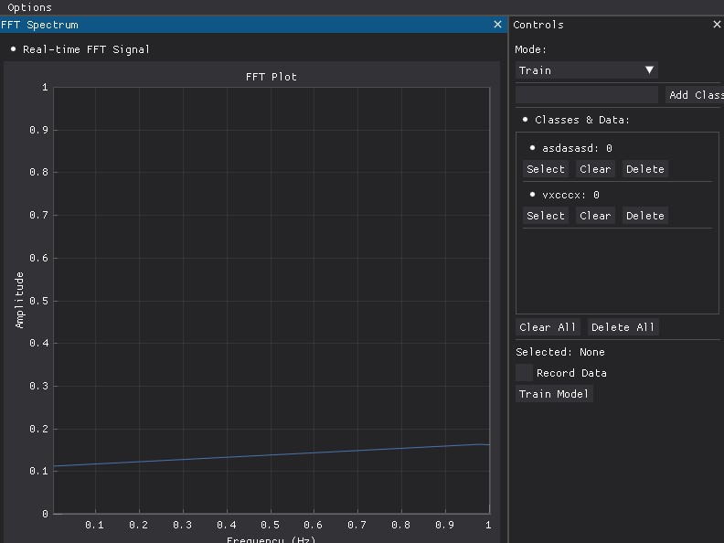
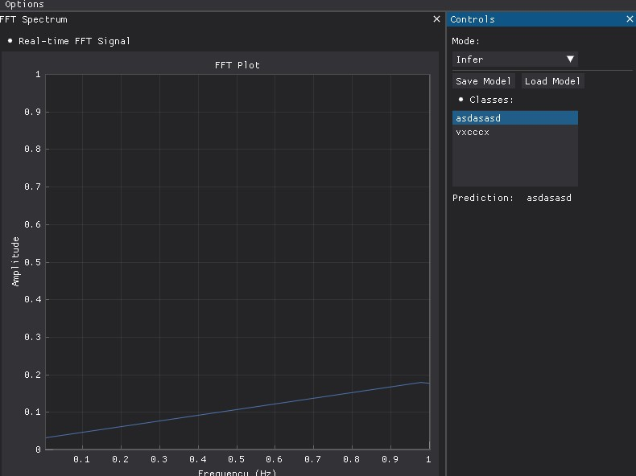

# Vibration Based Interactions Project

This repository contains the code for a vibration based interaction project. This implements a realtime GUI interface for audio signals to feed through Fast Fourier Transform and be visualized. Users can then use this data to train a machine learning model of their choice and check the predictions.

## Installation

First clone this repository using

```bash
git clone https://github.com/whuang37/vibration-interaction-bake-off.git
cd vibration-interaction-bake-off
```

We recommend using [uv](https://docs.astral.sh/uv/) for your package management. We provide instructions for uv and pip if necessary.

### uv

Users should first install uv from the instructions given [here](https://docs.astral.sh/uv/getting-started/installation/). While in the repository's directory, run the following for package setup.

```bash
uv sync
```

### Pip

Users should first be on ```Python 3.10```. Then run the following to install all necessary packages. We recommend using a package manager like venv.

```bash
python3.10 -m venv .venv
. .venv/bin/activate
pip install .
```

## Usage

### Starting Up
Using uv, run the following command to start the visualizer fft visualizer.

```bash
uv run visualizer.py
```

Using pip, ensure you have activated your virtual environment and run with the following commands.

```bash
.venv/bin/activate
python visualizer.py
```

### The Visualizer



Above is an image of the training gui. Before beginning, check to make sure you are using the correct device at the top options bar under "Options".

On the top left is a visualization of the realtime FFT generated from the selected audio device. Double click the plot to automatically adjust the x and y range. On the right is the training sidebar. Users can add new classes, select classes and then check the record button to add data into each class. Using the "Train Model" button, users can then train their selected model.



Upon selecting the "Infer" model, users will see the top gui. Here users can save their model they trained, load a previously trained model, and see the output of their trained models. All potential classes are listed as well as the current prediction. The predicted class will also be highlighted.

# Modifying

Users do not ever have to interact with any GUI code. Instead, [models.py](models.py) contains all the necessary interfaces to implement and train your own models. See the file for more details on each function and how to modify and use them.

# Contributing

Please report any issues through Github. If you'd like to contribute, please fork and open a pull request.

# Acknowledgements

This project was created as a part of UCLA's EC ENGR 239AS Designing Interactive Systems and the Los Angeles Computing Circle's curriculum. 

# License

This project is licensed under the MIT License.
